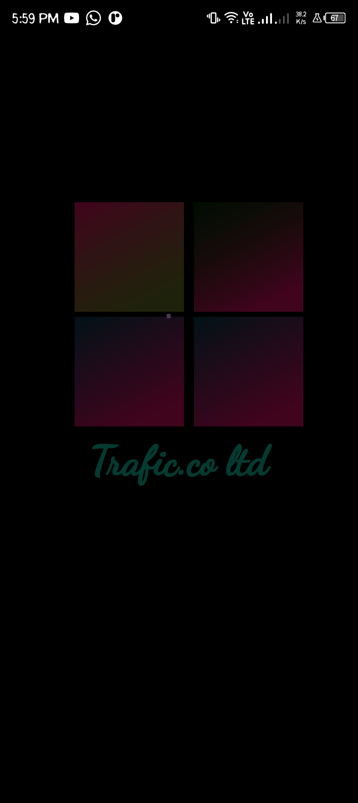

# tuto_rt

# Flutter Onboarding Screen Project

## Overview

This Flutter project demonstrates a simple onboarding screen with loading animations. It is part of my learning journey as I explore Flutter and build various UI components.

## Features

- Onboarding screen with loading animations


## Screenshots




## Getting Started

Follow the steps below to set up and run the project on your local machine.

### Prerequisites

- Flutter installed on your machine
- An IDE (such as VSCode or Android Studio)

### Installation

1. Clone the repository:

   ```bash
   https://github.com/ManU4kym/tuto_rt.git
